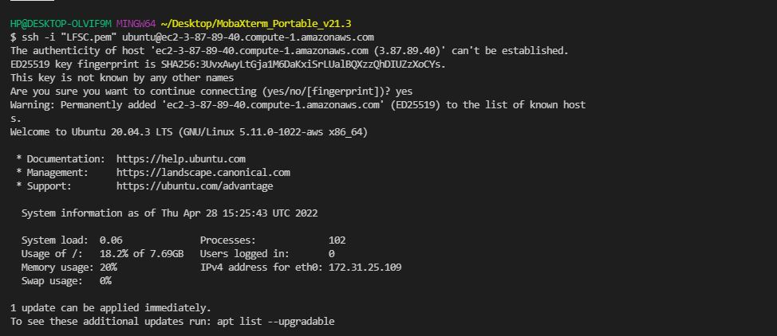
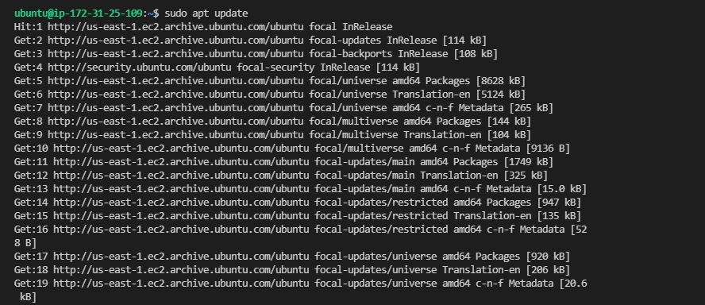
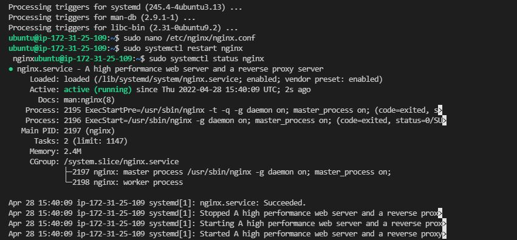
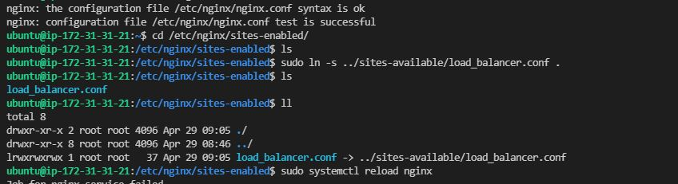
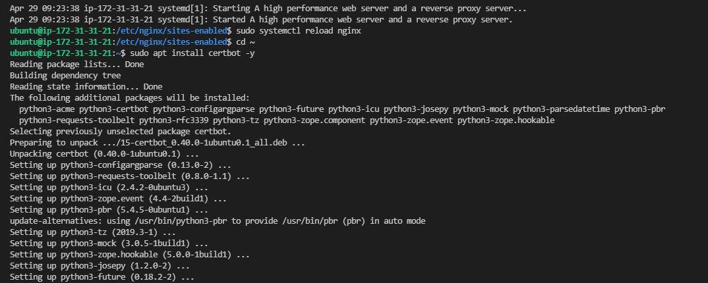
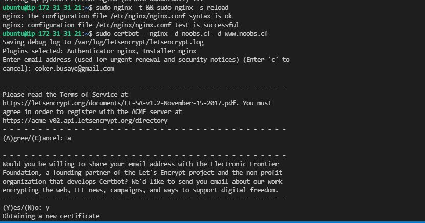
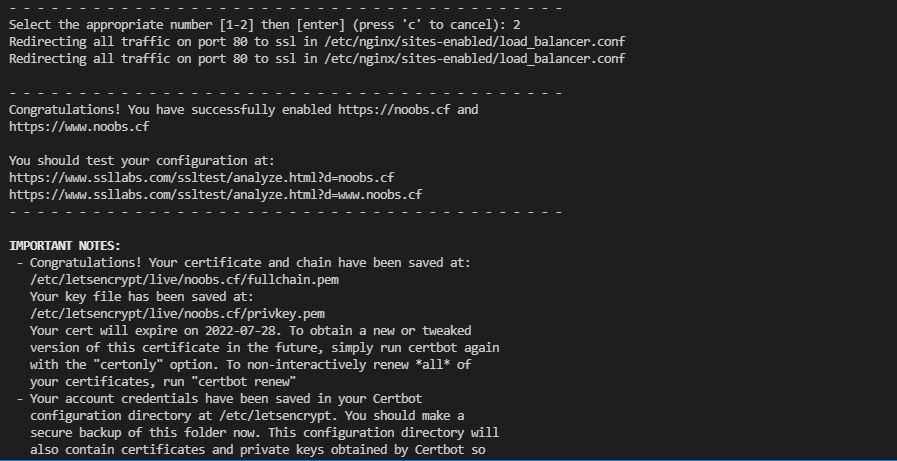
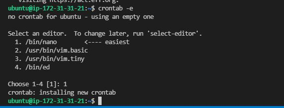
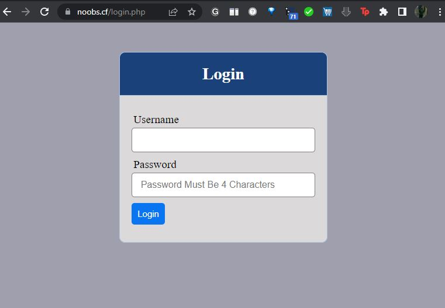

# Documentation for Project 10 - Load Balancer with Nignix and TLS/SSL
- Step 1 -- Setup Servers on AWS
   
     ```
     sudo apt update && sudo apt install nginx -y
     sudo systemctl enable ngnix && sudo systemctl status ngnix
     ```

   -  
  
   -  
  
### Setup Nginx and configure 
  
   - `sudo nano /etc/nginx/nginx.conf`
  
    ```
    upstream web {
    server 3.92.228.135 weight=5;
    server 3.87.55.140 weight=5;
    server 3.84.154.27 weight=5;
    }

    server {
    listen 80;
    server_name noobs.cf www.noobs.cf;
    location / {
      proxy_set_header X-Forwarded-For $proxy_add_x_forwarded_for;
      proxy_pass http://web;
        }
    }
    ```

    ```
    sudo systemctl restart nginx && sudo systemctl status nginx
    sudo systemctl reload ngnix
    ```

### Test if configuration file was setup correctly 

   - `sudo ngnix -t` 
  
   - 
  
   - 
  
   - 
  
   - 
  
### Install Certbot

    ```
     sudo systemctl status snapd && sudo snap install --classic certbot
     sudo ln -s /snap/bin/certbot /usr/bin/certbot
     sudo certbot --nginx
    ```

   -  
  
   -  
  
   -  

 